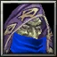
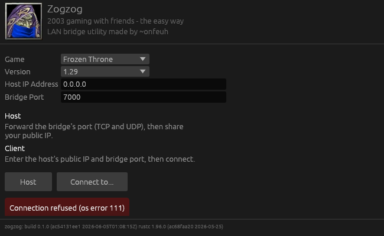

#  Zogzog
 
Play Warcraft 3 LAN with your friends over the internet, the simple way. No VPNs, no fiddling with network settings - 2003 gaming the way it ought to be. Cross-platform and Linux friendly.
 
> Well, almost no fiddling. The host opens one port and you're set. See [Usage](#usage).
 

## Requirements
- Warcraft 3 (Legacy,<=1.29)
- Confirmed to work on Windows 11 and Linux

## Download
- [Windows](https://github.com/onfeuh/zogzog/releases/download/0.1.0/zogzog-v0.1.0-win.exe) - `zogzog-v0.1.0-win.exe`
- [Linux](https://github.com/onfeuh/zogzog/releases/download/0.1.0/zogzog-v0.1.0-linux) - `zogzog-v0.1.0-linux`

## How to use
**TL;DR - One person hosts. The host runs the bridge AND hosts the game. Players start and connect to the bridge, and then join the game as usual.**

 
### Host
1. Open the bridge port in your router - default `7000` TCP/UDP.
2. Start the utility and click `Host`.
3. Share your public IP (and port, if non-default) with the players.
4. Start a LAN game in Warcraft 3 as usual.

### Players
1. Start the utility.
2. Enter the host's IP and port, click `Connect to...`.
3. The host's game appears in your Warcraft 3 LAN list. Join it.
The host's logs should show clients pinging in and the peer count rising. If the host has started a game, players should see `GAMEINFO` packets coming through.
 
## How does it work?
 
In Warcraft 3, LAN lobbies are announced over UDP broadcast on `255.255.255.255:6112`. Clients shout "anyone hosting?" on the local network; the host replies on the same channel with the game info. Clicking the listed game opens a TCP connection that handles the rest.
 
Zogzog is two systems stitched together, a discovery system that impersonates a LAN client searching for lobbies and relaying the hosts reply to every connected peer, and a a simple TCP proxy that forwards the game data stream between each peer and the host.

## Why did you make this?
 
I love playing Warcraft 3 custom games with the gang, but convincing everyone to install a VPN and wrestle with network issues was a hassle. Existing solutions were unreliable or painful with my setup - Warcraft 3 over WINE on Linux. I wanted a clean slate I have full control of.
 
## Troubleshooting
 
### I can't see any lobby in LAN
Confirm the bridge host and the game host are the same machine. Check the utility logs - if the host has started a game, you should see `GAMEINFO` packets arriving. If they arrive but nothing shows in game, it's most likely a version mismatch between players. If versions match and it still fails, the bridge can't reach your game (it shouldn't happen) - file an issue.
 
### I see the lobby, but I can't join
UDP discovery works, but the TCP proxy is failing. Try switching your game port (Warcraft 3 settings) from `6112` to the bridge port. If that doesn't fix it, something is badly wrong and it should have thrown a clear error - file an issue.
 
## 🇫🇷 Du travail, encore du travail ...

Liste de maps cools à essayer avec les copains, compatible avec Warcraft 3 Legacy :
- [Orc Gladiators : Revenge 1.41g](https://www.epicwar.com/maps/291574/)
- [Warlock 1.02](https://www.epicwar.com/maps/278295/)
- [Fortress Survival 6.76P](https://www.epicwar.com/maps/261359/)

Si tu trouves ce logiciel utile et que tu aimes Warcraft 3, n'hésite pas à [m'envoyer un message](https://controlistes.fr/).

